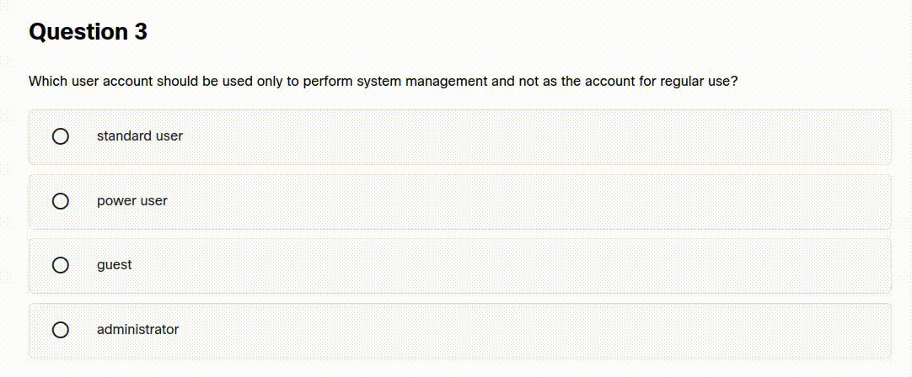
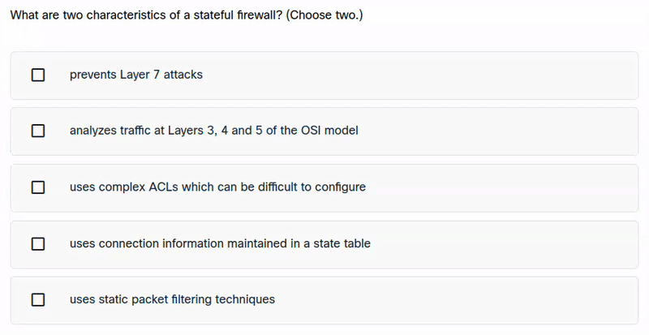

# NetAcad Solver


## Manual Installation

### 1. Prepare the Project

```bash
# Navigate to the project folder
cd netacad-solver

# Install dependencies
npm install

# Build the extension in development mode
npm run start
The npm run start command will be "watching" for changes, so keep it running in the terminal.

2. Load the Extension in Your Browser
```

<details>
  <summary>For Chrome/Brave/Edge (Chromium users): (click)</summary>

Open your browser
Go to chrome://extensions/ (or brave://extensions/, edge://extensions/)
Enable "Developer mode" in the top right corner
Click "Load unpacked"
Select the dist folder inside your project
That's it! Extension is now ready to use 🎉

</details>

<details>
  <summary>For Firefox users: (click)</summary>

Open Firefox
Go to about:debugging#/runtime/this-firefox
Click "Load Temporary Add-on..."
Navigate to the dist folder and select the manifest.json file
That's it! Extension is now ready to use 🎉

</details>

## Usage

1. Open your course at [Netacad.com](https://netacad.com/)
2. Use one of following options:

- Click on quiz question and the right option(s) should be selected automatically
- Hover over the answers while holding the `Ctrl` button and the right option(s) should select automatically



